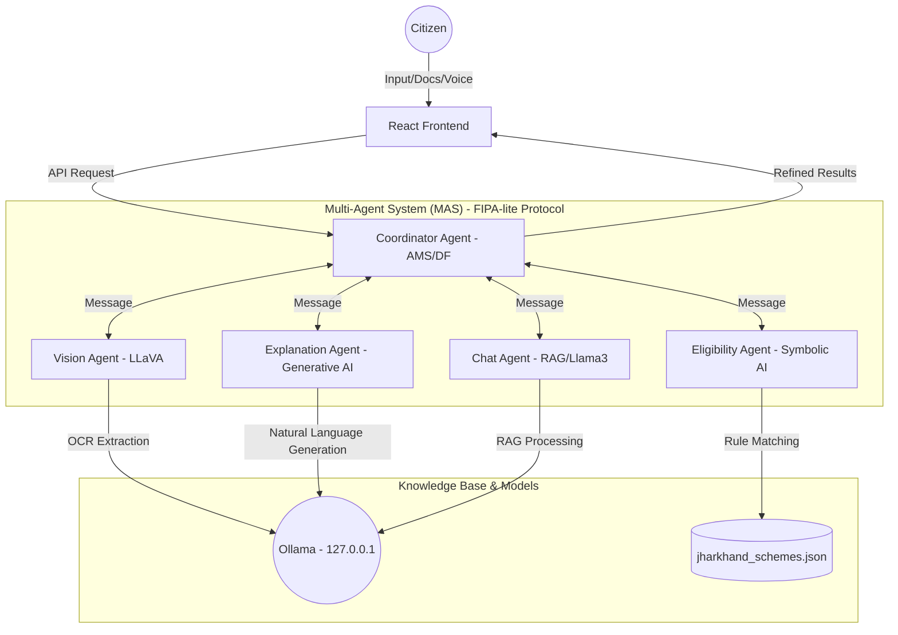

# Samarth: Hybrid Symbolic-Generative Multi-Agent System (MAS)
### Research-Grade Digital Assistant for Jharkhand E-Governance
**Project:** MCA Dissertation - VIT Vellore  
**Developer:** Yashwant Mandal  

---

## 🏛️ Project Overview
**Samarth** is a sophisticated, offline-first Multi-Agent System designed to bridge the digital divide in Jharkhand's e-governance landscape. It addresses the complexity of government policy accessibility by combining **Symbolic AI** (deterministic rule engines) with **Generative AI** (Large Language Models) to provide accurate, explainable, and highly accessible scheme recommendations.

The system is specifically engineered for users with low digital literacy, featuring multimodal document scanning (OCR) and voice-enabled interactions (STT/TTS).

---

## 📐 System Architecture
Samarth follows a **Hybrid Symbolic-Generative Architecture** using a **FIPA-lite (Foundation for Intelligent Physical Agents)** message-passing protocol.

### Architecture Diagram


---

## 🤖 Modular Agents & Responsibilities
The system is composed of specialized autonomous agents that communicate via a **Coordinator Agent** (acting as the Agent Management System).

| Agent | Responsibility | Core Technology |
| :--- | :--- | :--- |
| **Coordinator Agent** | Orchestrates inter-agent interaction protocols and manages state. | Node.js / FIPA-lite |
| **Vision Agent** | Extracts user attributes from uploaded documents (Aadhaar, Certificates). | Ollama (LLaVA) |
| **Eligibility Agent** | Executes deterministic rule-based matching against the policy database. | Symbolic AI / Weighted Logic |
| **Explanation Agent** | Translates logical reasoning paths into professional, accessible language. | Ollama (Llama3) / XAI |
| **Chat Agent** | Provides natural language assistance with RAG-based context. | Llama3 / RAG |

---

## 🔄 Core Workflow (Step-by-Step)

1. **Smart Intake**: The user uploads a document (Aadhaar/Certificate) or manually fills a 5-step wizard.
2. **Vision Processing**: The **Vision Agent** uses LLaVA to perform OCR and extract profile data (Name, Age, Gender, Income, etc.) to auto-fill the form.
3. **Intent Selection**: The user selects a "Preferred Field" (e.g., Education, Agriculture, Women Welfare) to guide the search.
4. **Symbolic Reasoning**: The **Eligibility Agent** cross-references the user profile against 90+ normalized schemes in `jharkhand_schemes.json`.
   - *Logic*: Uses weighted matching (Occupation: 30%, Income: 20%, Category: 20%, etc.).
   - *Preference Boost*: Adds a +25% weight boost for schemes matching the user's "Preferred Field".
5. **Generative Explanation (XAI)**: The **Explanation Agent** takes the mathematical "Reasoning Path" from the Eligibility Agent and translates it into bulleted, human-readable markdown.
6. **Executive Summary**: The system generates a typewriter-effect summary on the results page using the **Coordinator Agent's** synthesis.

---

## 📂 Project Structure

```text
samarth/
├── backend/                # MAS Server (Node.js/Express)
│   ├── agents/             # Autonomous Agent Definitions
│   │   ├── CoordinatorAgent.js   # Agent Management System (AMS)
│   │   ├── EligibilityAgent.js   # Symbolic Matching Engine
│   │   ├── ExplanationAgent.js   # Generative XAI Agent
│   │   ├── VisionAgent.js        # Multimodal OCR Agent
│   │   └── chatAgent.js          # RAG Chat Assistant
│   ├── dataset/            # Policy Knowledge Base
│   │   └── jharkhand_schemes.json # 90+ Normalized Schemes (Updated Aug 2024)
│   ├── services/           # External System Integrations
│   │   └── ollamaService.js # Local LLM Orchestration (127.0.0.1)
│   └── server.js           # API Entry Point
└── frontend/               # User Interface (React/Tailwind)
    ├── src/
    │   ├── assets/         # Brand Identity (Samarth Logo)
    │   ├── pages/          # Research-Grade UI Views
    │   │   ├── LandingPage.js        # Dynamic Hero Section
    │   │   ├── SchemeFinderWizard.js # 5-Step Smart Intake with Sequential MAS Animation
    │   │   ├── ResultsPage.js        # AI Executive Summary & Match Cards
    │   │   ├── AIChatPage.js         # Voice-Enabled (STT/TTS) RAG Assistant
    │   │   └── SchemeExplorerPage.js # Categorized Policy Database
    │   └── App.js          # Navigation & Brand Header
```

---

## 🚀 Key Technical Features

- **Offline-First Privacy**: Zero dependency on cloud APIs. All sensitive data stays on the user's local machine using `127.0.0.1`.
- **Hybrid AI**: Combines the *accuracy* of Symbolic AI with the *accessibility* of Generative AI.
- **Explainable AI (XAI)**: Provides a clear audit trail for why a user is eligible or ineligible for a scheme.
- **Accessibility Layer**: Integrated Web Speech API for voice commands and document scanning for low-literacy users.
- **Enterprise UI**: Custom Slate/Indigo design system with Framer Motion animations and dynamic browser tab titles.

---

## 🛠️ Installation & Setup

### 1. Model Environment (Ollama)
Install [Ollama](https://ollama.com/) and download the required models:
```bash
# Start Ollama with CORS enabled
set OLLAMA_ORIGINS="*" 
ollama serve

# Pull models
ollama pull llama3:8b
ollama pull llava
```

### 2. Execution
```bash
# Backend
cd backend && npm install && node server.js

# Frontend
cd frontend && npm install && npm start
```

---
**Remote Origin:** [https://github.com/yashwantmandal26/samarth-OFFILINE.git](https://github.com/yashwantmandal26/samarth-OFFILINE.git)  
© 2026 Samarth • Empowering Jharkhand through Hybrid AI Intelligence
