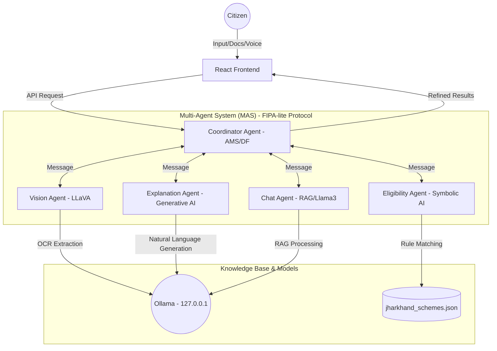

# Samarth: Project Documentation

## Table of Contents 
 
 1. [Project Overview](#project-overview) 
 2. [Key Features](#key-features) 
 3. [Architecture](#architecture) 
 4. [Tech Stack](#tech-stack) 
 5. [Project Structure](#project-structure) 
 6. [Pages & Routes](#pages--routes) 
 7. [Component Documentation](#component-documentation) 
 8. [Backend (API & Agents)](#backend-api--agents) 
 9. [Database Schema](#database-schema) 
 10. [AI Integration](#ai-integration) 
 11. [Design System](#design-system) 
 12. [Getting Started](#getting-started) 
 13. [Environment Variables](#environment-variables) 
 14. [Deployment](#deployment) 
 15. [Schemes Coverage](#schemes-coverage) 
 16. [Future Roadmap](#future-roadmap)

---

## 1. Project Overview
**Samarth** is a research-grade, offline-first **Hybrid Symbolic-Generative Multi-Agent System (MAS)** designed to revolutionize policy accessibility in Jharkhand. Developed as an MCA Dissertation project for VIT Vellore, it bridges the gap between complex government jargon and citizen understanding through advanced AI orchestration.

## 2. Key Features
- **Offline-First Privacy**: All processing occurs locally via Ollama, ensuring data sovereignty.
- **Multimodal Intake**: Vision Agent (LLaVA) extracts profile data from documents (Aadhaar, Certificates) via OCR.
- **Explainable AI (XAI)**: Generative agents explain *why* a user is eligible using symbolic reasoning paths.
- **Voice-Enabled Interface**: Integrated STT (Speech-to-Text) and TTS (Text-to-Speech) for low-literacy accessibility.
- **Smart Wizard**: A 5-step intuitive profiling system with real-time agent status tracking.
- **Policy Simulation**: Predictive analysis of how profile changes affect eligibility.

## 3. Architecture
The system employs a **FIPA-lite Protocol** for inter-agent communication, managed by a Central Coordinator.

### Architecture Diagram


- **Coordinator Agent (AMS/DF)**: Orchestrates the workflow and manages the message-passing protocol.
- **Vision Agent**: Handles multimodal document analysis using a Hybrid OCR approach (EasyOCR for stable, accurate text extraction + Llama3 for semantic parsing).
- **Eligibility Agent**: Executes deterministic, rule-based matching (Symbolic AI).
- **Explanation Agent**: Translates complex logic into human-readable vernacular summaries.
- **Chat Agent**: A RAG (Retrieval-Augmented Generation) assistant for real-time policy queries.

## 4. Tech Stack
- **Frontend**: React.js, Tailwind CSS, Framer Motion (Animations), Lucide-React (Icons).
- **Backend**: Node.js, Express.js.
- **AI Models**: Ollama (Llama3:8b for reasoning, LLaVA for vision).
- **State Management**: React Context API (Language/Theming).
- **Communication**: REST API + FIPA-lite Agent Protocol.

## 5. Project Structure
```text
samarth/
├── backend/                # Node.js Agent Server
│   ├── agents/             # MAS Logic (Coordinator, Eligibility, etc.)
│   ├── dataset/            # Knowledge Base (jharkhand_schemes.json)
│   ├── services/           # External Service Wrappers (Ollama)
│   └── server.js           # API Gateway
└── frontend/               # React Application
    ├── src/
    │   ├── components/     # Reusable UI Elements
    │   ├── context/        # Global State (Language)
    │   ├── pages/          # Application Views
    │   └── services/       # API Clients
```

## 6. Pages & Routes
- **`/` (LandingPage)**: High-impact entry point with platform highlights.
- **`/finder` (SchemeFinderWizard)**: Sequential 5-step data intake with document upload support.
- **`/results` (ResultsPage)**: AI-generated executive summary and categorized scheme cards.
- **`/scheme/:id` (SchemeDetailPage)**: Comprehensive breakdown of specific policy requirements.
- **`/explorer` (SchemeExplorerPage)**: Searchable and filterable database of all 90+ schemes.
- **`/chat` (AIChatPage)**: Full-screen AI Assistant with voice interaction.

## 7. Component Documentation
- **`LanguageToggle`**: Handles switching between English, Hindi, and Hinglish via `LanguageContext`.
- **`NavLink`**: Custom navigation component with active state styling.
- **`LanguageModal`**: Initial entry modal to set user preference.
- **`ScrollToTop`**: Utility to reset window position on route changes.

## 8. Backend (API & Agents)
The backend functions as a **Multi-Agent Orchestrator**:
- **`POST /api/recommendations`**: The primary entry point for the Samarth workflow (Vision -> Eligibility -> Explanation).
- **`POST /api/chat`**: Stateless RAG interaction for the AI Assistant.
- **`POST /api/simulate`**: Calculates eligibility deltas based on hypothetical profile changes.
- **`GET /api/schemes`**: Serves the normalized policy dataset.

## 9. Database Schema
Stored in `jharkhand_schemes.json` as a collection of objects:
```json
{
  "id": "jh-001",
  "scheme_name": "String",
  "department": "String",
  "category": "String",
  "benefits": "String",
  "eligibility": {
    "gender": "String",
    "age_min": "Number",
    "income_limit": "Number",
    "social_category": ["Array"]
  },
  "documents_required": ["Array"]
}
```

## 10. AI Integration
- **RAG (Retrieval-Augmented Generation)**: The Chat Agent retrieves relevant scheme snippets to ground Llama3's responses.
- **Symbolic-Generative Handshake**: The Eligibility Agent passes a "Reasoning Chain" to the Explanation Agent to ensure factual accuracy in AI summaries.

## 11. Design System
- **Theme**: "Local Intelligence" (Slate 900, Indigo 600, Emerald 500).
- **Typography**: Inter (Sans-serif) for readability.
- **Interactions**: Sequential animations via Framer Motion to reduce cognitive load.

## 12. Getting Started
1. **Install Ollama**: [ollama.com](https://ollama.com)
2. **Pull Models**:
   ```bash
   ollama pull llama3:8b
   ```
3. **Setup OCR (EasyOCR)**:
   Ensure Python is installed, then run:
   ```bash
   pip install easyocr
   ```
4. **Setup Backend**:
   ```bash
   cd backend && npm install && node server.js
   ```
5. **Setup Frontend**:
   ```bash
   cd frontend && npm install && npm start
   ```

## 13. Environment Variables
- `PORT`: Server port (default 5000).
- `OLLAMA_BASE_URL`: Local endpoint for AI models (default `http://127.0.0.1:11434`).

## 14. Deployment
The project is designed for local deployment to maintain privacy. Remote access can be enabled via `ngrok` or traditional VPS hosting, provided the Ollama service is reachable.

## 15. Schemes Coverage
Currently covers **90+ normalized schemes** across:
- Education & Scholarships
- Agriculture & Farmer Welfare
- Women & Child Development
- Social Security & Pensions
- Healthcare (Ayushman Bharat, etc.)

## 16. Future Roadmap
- **Real-time Integration**: API hooks for live application status tracking.
- **Mobile Native**: React Native port for Android/iOS.
- **Expansion**: Extension to other Indian states (Bihar, Odisha).
- **Local Voice Models**: Moving STT/TTS from Web Speech API to local Whisper/Piper models.

---
**Developer**: Yashwant Mandal  
**GitHub**: [samarth-OFFILINE](https://github.com/yashwantmandal26/samarth-OFFILINE.git)
