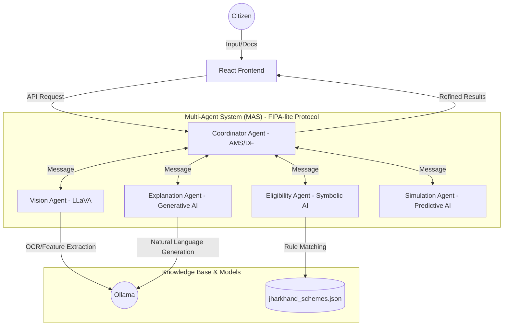

# Samarth: Hybrid Symbolic-Generative Multi-Agent System (MAS)
### Research-Grade Digital Assistant for Jharkhand E-Governance

Samarth is a research-oriented, full-stack Multi-Agent System (MAS) designed for the dissertation project of MCA. It addresses the complexity of government policy accessibility in Jharkhand by combining **Symbolic AI** (deterministic rule engines) with **Generative AI** (Large Language Models) to provide accurate, explainable, and accessible scheme recommendations.

---

## 🏛️ System Architecture

Samarth implements a **Hybrid Symbolic-Generative Multi-Agent Architecture** using a FIPA-lite message-passing protocol. This ensures a clear separation between logical eligibility evaluation and natural language explanation.

### 📐 Architecture Diagram


---

## 🤖 Modular Agents & Responsibilities

The system is composed of several specialized agents that communicate via a **Coordinator Agent** (acting as the Agent Management System).

| Agent | Responsibility | Core Technology |
| :--- | :--- | :--- |
| **Coordinator Agent** | Orchestrates inter-agent interaction protocols and manages state. | Node.js / FIPA-lite |
| **Vision Agent** | Extracts user attributes from uploaded documents (Aadhaar, Certificates). | Ollama (LLaVA) |
| **Eligibility Agent** | Executes deterministic rule-based matching against the policy database. | Symbolic AI / Weighted Logic |
| **Explanation Agent** | Translates logical reasoning paths into professional, accessible language. | Ollama (Llama3) / XAI |
| **Simulation Agent** | Performs "What-if" analysis to predict impact of socio-economic changes. | Predictive Logic |
| **Chat Agent** | Provides natural language assistance with RAG-based context. | Llama3 / RAG |

---

## 📂 Project Structure

```text
samarth/
├── backend/                # MAS Server (Node.js/Express)
│   ├── agents/             # Autonomous Agent Definitions
│   │   ├── CoordinatorAgent.js   # Agent Management System (AMS)
│   │   ├── EligibilityAgent.js   # Symbolic Matching Engine
│   │   ├── ExplanationAgent.js   # Generative XAI Agent
│   │   ├── VisionAgent.js        # Multimodal OCR Agent
│   │   ├── SimulationAgent.js    # Predictive Impact Agent
│   │   └── chatAgent.js          # RAG Chat Assistant
│   ├── dataset/            # Policy Knowledge Base
│   │   └── jharkhand_schemes.json # 90+ Normalized Schemes
│   ├── services/           # External System Integrations
│   │   └── ollamaService.js # Local LLM Orchestration
│   └── server.js           # API Entry Point
└── frontend/               # User Interface (React/Tailwind)
    ├── src/
    │   ├── pages/          # Research-Grade UI Views
    │   │   ├── SchemeFinderWizard.js # 5-Step Smart Intake
    │   │   ├── ResultsPage.js        # AI Executive Summary View
    │   │   └── AIChatPage.js         # Voice-Enabled Assistant
    │   └── services/       # API Communication
    │       └── api.js      # Backend Protocol Client
```

---

## 🚀 Technical Features

- **Offline-First Intelligence**: Zero dependency on external cloud APIs. All processing (OCR, LLM, Logic) happens on `127.0.0.1`.
- **Explainable AI (XAI)**: Generates logical "Reasoning Paths" from Symbolic AI which are then simplified by the Generative AI to prevent hallucinations.
- **Multimodal Intake**: Direct document processing using Vision-LLMs to reduce digital friction for rural users.
- **Voice-Enabled Interface**: Native Web Speech API integration (STT/TTS) for low-literacy accessibility.
- **Enterprise UI**: Built with a strict Tailwind CSS design system, featuring typewriter effects and glassmorphism.

---

## 🛠️ Installation & Prerequisites

### 1. Model Environment (Ollama)
Install [Ollama](https://ollama.com/) and download the required research models:
```bash
# Start Ollama with CORS enabled for local dev
set OLLAMA_ORIGINS="*" 
ollama serve

# Pull models
ollama pull llama3
ollama pull llava
```

### 2. Backend Setup
```bash
cd backend
npm install
node server.js
```

### 3. Frontend Setup
```bash
cd frontend
npm install
npm start
```

---

## 📜 Research Credits
**Project:** Samarth – MCA Dissertation  
**Developer:** Yashwant Mandal  
**Institution:** [Insert Institution Name]  
**Remote Origin:** [https://github.com/yashwantmandal26/samarth-OFFILINE.git](https://github.com/yashwantmandal26/samarth-OFFILINE.git)

---
© 2026 Government of Jharkhand • Local AI Powered Platform
